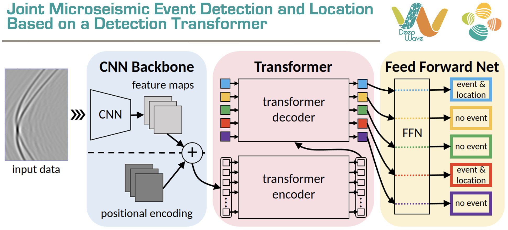

Reproducible material for

**Joint Microseismic Event Detection and Location with a Detection Transformer - Yang Y., Birnie C., Alkhalifah T.**

[Click here]([https://github.com/DeepWave-KAUST](https://onlinelibrary.wiley.com/doi/10.1111/1365-2478.70040?af=R)) to access the paper.


# Project structure
This repository is organized as follows:

* :open_file_folder: **asset**: folder containing logo;
* :open_file_folder: **data**: folder containing data for network training and testing;
* :open_file_folder: **MicroseismicDETR**: python libraries containing the main code and all packages;
* :open_file_folder: **network**: folder used for holding the trained networks;
* :open_file_folder: **notebooks**: jupyter notebooks reproducing the experiments in the paper (see below for more details);
* :open_file_folder: **scripts**: python scripts used to run experiments;


## Notebooks
The following notebooks are provided:

- :orange_book: ``test_network.ipynb``: notebook performing predictions on one-, two-, three-event input data segments;


## Getting started :space_invader: :robot:
To ensure reproducibility of the results, we suggest using the `environment.yml` file when creating an environment.

Simply run:
```
bash install_env.sh
```
It will take some time, if at the end you see the word `Done!` on your terminal you are ready to go. 

Remember to always activate the environment by typing:
```
conda activate MEDL
```

**Disclaimer:** All experiments have been carried on a Intel(R) Xeon(R) CPU @ 2.10GHz equipped with a single NVIDIA A100 Tensor Core GPU. Different environment configurations may be required for different combinations of workstation and GPU.


## Data preparation
Download synthetic datasets for training and testing the network from [here](https://zenodo.org/records/13851927). Please kindly place them inside the ```data``` directory.


## Run experiments
Under the folder ```scripts```, kindly run in the terminal:
```
bash train_network.sh
```


## Cite us 
```
@article{yang2023joint,
  title={Joint microseismic event detection and location with a detection transformer},
  author={Yang, Yuanyuan and Birnie, Claire and Alkhalifah, Tariq},
  journal={Geophysical Prospecting},
  pages={e70040},
  year={2023},
  publisher={Wiley Online Library}
}```
